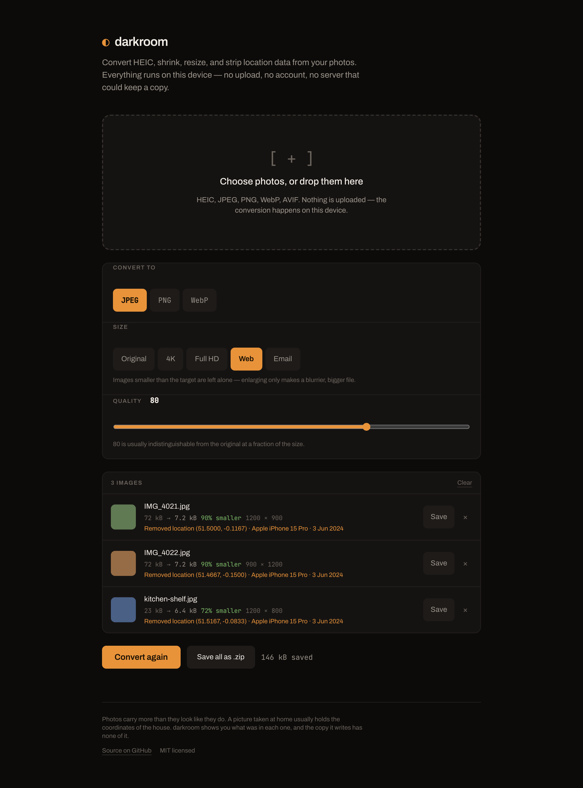
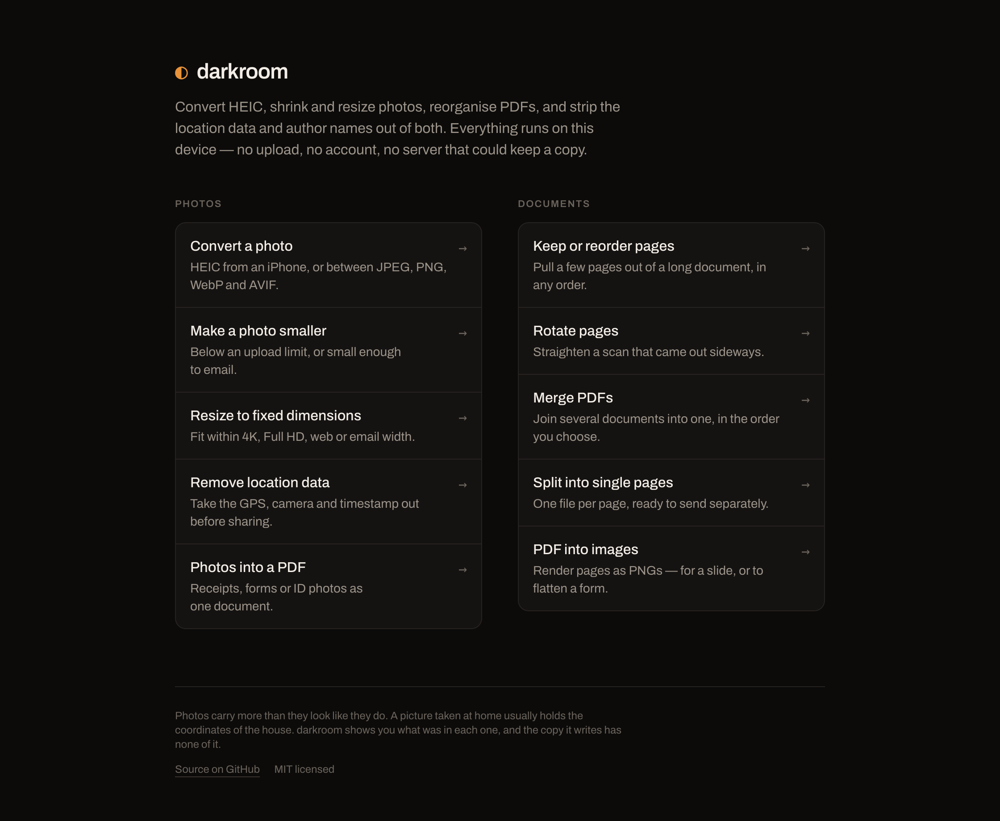
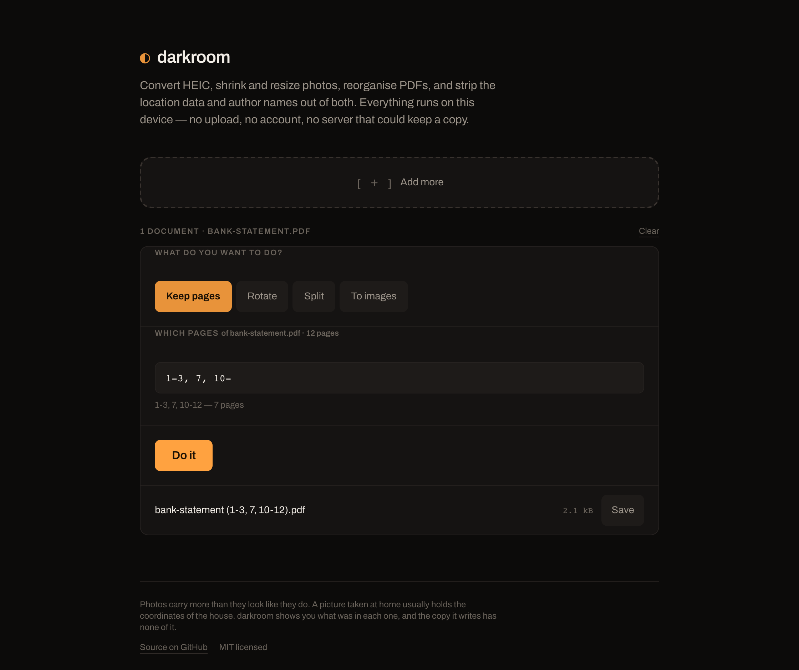

<div align="center">

# ◐ darkroom

**Image and PDF tools that never leave your device.**

Convert HEIC, shrink and resize photos, reorganise PDFs, and strip the location data and author names out of both — entirely in your browser.

**[Use it →](https://bleakmidwinter90.github.io/darkroom/)**

[](https://github.com/BleakMidwinter90/darkroom/actions/workflows/ci.yml)
[](LICENSE)



</div>

---

## Why this exists

Converting a HEIC photo, shrinking one for email, or stripping the location out before posting it are all things people do constantly — and almost always on an ad-choked website that asks them to upload the photo to a stranger's server first.

That is a genuinely bad trade. The photos people most want to convert are the personal ones, and the thing they least want to do with a personal photo is send it somewhere they cannot see.

darkroom does the same work in the browser. There is no upload, no account, and no server that could keep a copy — the app is a static bundle, and there is not a single network call in the conversion path.

## What it does

It opens on a list of jobs rather than a file picker, because "choose photos, or drop them here" describes the mechanism and not the work — someone arriving with a twelve page statement and one page they need had no way to know that was even on offer.



Picking a job seeds the settings it implies — "make a photo smaller" arrives at a dimension cap and real compression, because quality alone does not get a modern phone photo under a mail limit. Nothing is locked afterwards: every control stays editable, and a file of the other kind is handled rather than turned away. Each tool has its own address, so `#merge` opens the merger and the back button returns to the list.

**Converts HEIC.** The format every iPhone shoots in and half the web still cannot open. No browser decodes it natively, so darkroom loads a WebAssembly decoder — but only when you actually give it a HEIC file, so nobody pays 3 MB for a codec they don't need.

**Shrinks things.** Quality slider, live before-and-after sizes, and an honest verdict on each file — including when a conversion made something *bigger*, which genuinely happens and which most tools quietly hide.

**Leaves the format alone when you ask it to.** Every output has to name a format, so "remove location data" used to send a PNG screenshot out as a JPEG — lossy, with transparency flattened, for a job that only strips metadata. *Keep format* is now the first option and the default for that job. HEIC falls back to JPEG because no browser can write HEIC, and GIF, BMP and TIFF go to PNG, where JPEG's ringing would be most obvious.

**Resizes sensibly.** Presets named for what they are for (Email, Web, Full HD, 4K). Images already smaller than the target are left alone, because enlarging a photo only produces a blurrier, larger one.

**Shows you what your photos are carrying, then removes it.** This is the part people don't expect.

> Removed location (51.5000, -0.1167) · Apple iPhone 15 Pro · 3 Jun 2024

A photo taken at home holds the coordinates of the house, to about four metres. Most people have never been told that. darkroom reads the metadata out of the original, shows you exactly what was in there, and writes a copy with none of it.

**Works with the network off.** It installs to a home screen and runs offline, which is also the easiest way to satisfy yourself that the privacy claim is true — cut the wifi and convert a photo anyway. The CI suite does exactly that on every push.

The caveat, stated plainly: the two large optional pieces are fetched on first use rather than on install, so nobody downloads a decoder they never need. The HEIC decoder is a 3 MB WebAssembly chunk, and the PDF renderer is a 1.3 MB worker. Your *first* HEIC conversion and your *first* PDF-to-image both need a connection; every one after that does not, and the CI suite proves the second one works with the network cut.

**Handles a whole batch.** Drop in a hundred, convert them four at a time so the tab survives it, and save the lot as a zip.

**Reorganises PDFs too.** Five of the ten jobs are document work: keep or reorder pages, rotate a sideways scan, merge several files, split into one file per page, or render pages out as images. It strips the author name and title on the way out, the same way it strips EXIF from photos — Word and Acrobat write those into every export, and they travel with every copy.



Page selections are written the way you would say them — `1-3, 7, 10-` — and an out-of-range page is refused rather than quietly clamped, because silently handing back a document you did not ask for is worse than saying no.

**Turns images into a PDF, and back.** Photos of receipts, forms and passports are why most people go looking for an images-to-PDF site. Combine them onto A4 pages or at their own size. The PDF is built from the *converted* copies, so the location data does not simply move house — a PDF embeds JPEG bytes verbatim, EXIF block included, and nothing on screen would show it.

Two things it deliberately does not do. It will not **compress** a PDF: the library here manipulates structure and cannot recompress the embedded images that actually make a file large, so the button would mostly do nothing while implying otherwise — the honest route is PDF → images → PDF, offered as exactly that. And it will not **remove passwords**: stripping an owner password from a file you own is fine, but the same code path unlocks files you don't, and a browser tool is a poor place to draw that line.

## Try it

It is live at **[bleakmidwinter90.github.io/darkroom](https://bleakmidwinter90.github.io/darkroom/)**. Install it from the browser menu and it works offline afterwards.

To run it yourself:

```sh
git clone https://github.com/BleakMidwinter90/darkroom.git
cd darkroom
npm install
npm run dev
```

The build output is a plain static bundle — `npm run build` produces a `dist/` you can host anywhere. There is no backend to deploy because there is no backend. Serve it over HTTP rather than opening `index.html` directly: the offline support and the PDF renderer both use workers, which browsers refuse to load from `file://`. `node scripts/serve.mjs` does that, including on your local network.

| Command | What it does |
| --- | --- |
| `npm run dev` | Development server |
| `npm run build` | Static production build |
| `npm test` | Unit tests |
| `npm run typecheck` | TypeScript, no emit |
| `npm run lint` | Lint |
| `npm run smoke` | Builds, then tests it end to end in a real browser |

## How it works

The arithmetic — resize geometry, output naming, byte formatting, queue concurrency — lives in [`src/lib/`](src/lib/) as pure functions with no DOM, covered by 157 unit tests. Everything that touches a canvas or a codec is isolated in [`pipeline.ts`](src/lib/pipeline.ts).

Two details worth knowing:

**Orientation is applied before metadata is dropped.** A phone writes the sensor data unrotated and records "turn this 90°" in the EXIF. Strip the tag naively and every portrait photo comes out sideways — which is why so many browser image tools do exactly that. darkroom decodes with `imageOrientation: 'from-image'`, so the pixels are upright before the tag goes.

**Metadata removal is a property of the method, not a feature bolted on.** Re-encoding through a canvas cannot carry EXIF, so the copy simply has none. The CI smoke test decodes the actual output bytes and asserts the EXIF block is gone, rather than trusting that it should be.

## Browser support

Format availability is detected at runtime by encoding a real pixel and inspecting the result, because browsers will happily accept a MIME type they cannot write and hand back a PNG. You will see whichever of JPEG, PNG, WebP and AVIF your browser can genuinely produce.

## Contributing

Issues and pull requests welcome. Anything in `src/lib/` needs tests; anything touching the pipeline should keep the smoke test green.

```sh
npm test && npm run lint && npm run typecheck && npm run smoke
```

## License

[MIT](LICENSE).
